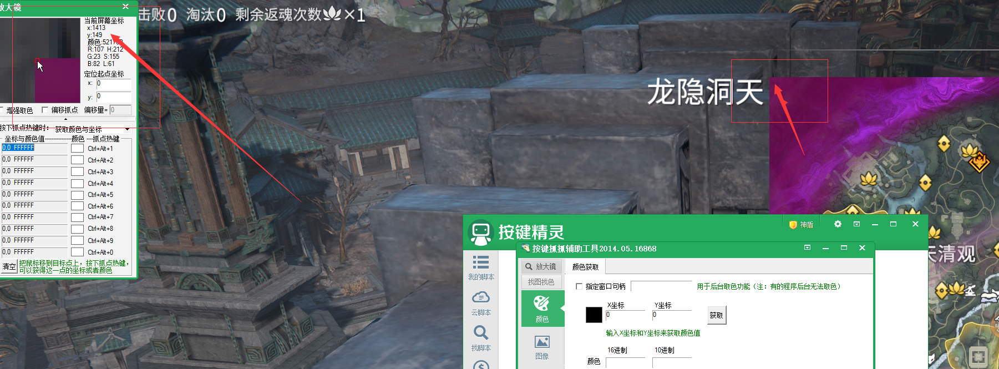
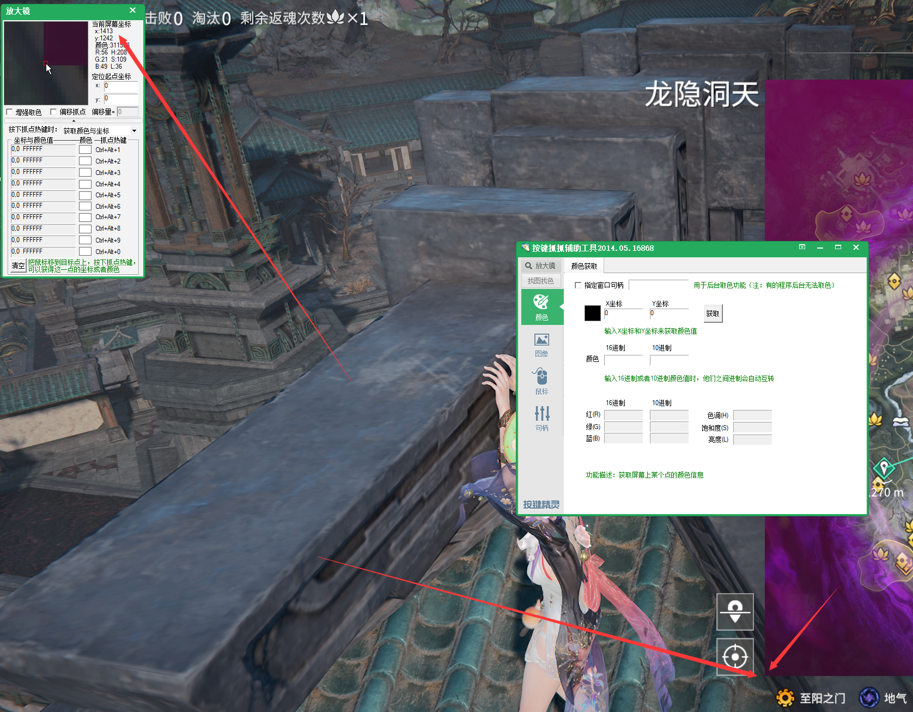
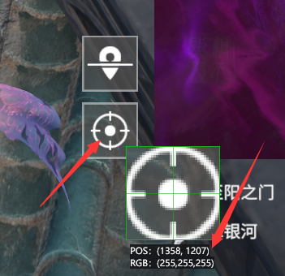

# NarakaMapTool (永劫无间资源地图辅助工具)

<p align="center">
  <b>永劫无间 (Naraka: Bladepoint)</b> 第三方资源地图辅助工具 —— 在游戏内地图上显示资源点位，支持一键自动标记。
</p>

<p align="center">
  
  
  
  
  
</p>

---

## ✨ 功能特性

- 🗺️ **八张地图支持**：支持聚窟州、火罗国、龙隐洞天、风起火罗、满江红、满江红-征神、宛渠、大风歌
- 🍖 **征神模式资源**：满江红-征神支持东坡肉坐标与专属图标标记
- 📍 **70+ 种资源标记**：萤火虫、金蟾、许愿水井、追击任务、宝窟、神火秘匣、贺兰艺等，应有尽有
- 🔍 **实时透明覆盖层**：在游戏地图上方叠加半透明标记层，不影响游戏操作
- 🔎 **地图缩放同步**：开启“允许缩放”后跟随游戏地图滚轮，以鼠标位置为锚点同步缩放资源标记和路线，默认关闭
- ⚡ **Alt 键快速标记**：打开地图后按 Alt，自动在鼠标附近的资源标记点上执行缩放和点击，快速设置导航
- 🎛️ **按住快捷呼出面板**：默认按住 `Ctrl + F1` 临时置顶控制面板，松开后自动最小化并返回游戏
- 🧭 **资源路线规划**：可在已显示的资源点之间生成路线，支持设置起点、排除点和一键重置
- 🎮 **自动检测地图开关**：像素级检测游戏地图的打开/关闭状态，覆盖层自动显隐
- 👁️ **无条件显示模式**：开启后不受游戏地图展开状态影响，始终显示透明图标地图，默认关闭
- 📐 **多分辨率适配**：以 2K（2560×1440）为基准自动缩放，支持不同分辨率
- 🎨 **背景地图控制**：可显示/隐藏背景地图，并通过滑动条调节透明度
- 🧩 **高精度瓦片背景**：缩放时按视口异步加载 z=3 到 z=5 瓦片，缺失或加载中自动回退到 2048 背景
- 🏯 **大风歌双层地图**：支持地表层与地下层背景、坐标和资源图标同步切换
- 📂 **配置自动生成**：首次运行自动生成 `config.json`，也可手动编辑微调参数
- 📋 **版本更新记录**：各版本功能、修复和数据更新详见 [CHANGELOG.md](CHANGELOG.md)

## 🖥️ 界面预览

控制面板包含以下区域：

| 区域 | 说明 |
|------|------|
| 顶部栏 | 地图选择下拉框 + 背景地图开关/透明度 + 地图缩放/无条件显示开关 + 全部显示/全部隐藏按钮 |
| 常用消耗 & 采集 | 萤火虫、许愿水井、迷你土地、金蟾、迎春靶、萤火笼、沙梨圣果、刺梨、沙叻、蒲公英、锦鲤、东坡肉 |
| 任务 & 挑战 | 连续寻宝任务、寻宝任务、祈福任务、礼敬任务、追击任务、叫阵任务、地脉仪 |
| 重要设施 | 货郎、返魂台、武器架、宝窟、封魔结界、回阳境、食人芋、雪莲、汤泉眼、贺兰艺 |
| 其他 | 金堆、绿堆（数据不全，实用性不高）、漂浮堆、侦察钟、攻城弩、入云臂、捕兽夹、野生动物、篝火、愈柳、老鼠、土地庙、雷池铜钱、铁背龟、紫霄珊瑚等 |
| 摸金资源 | 神火秘匣、藤鬼据点、土堆、显宝碑、金色遗珍、武器匣、洞窟钥匙、断章、安魂钟、裂隙出口等 |

每个资源类型都有独立的勾选框，可以自由组合显示。

## 📥 下载与安装

### 从 Release 下载（推荐）

前往 [Releases](../../releases) 页面下载最新版本的 ZIP 压缩包。

解压后的目录结构如下：

```
NarakaMapTool/
├── NarakaMapTool.exe    # 主程序
├── resources/            # 资源数据
│   ├── icons/            # 标记图标
│   └── resources_naraka.json  # 资源坐标数据库
├── map/                  # 背景地图图片
│   └── tiles/             # 可选的高精度运行时瓦片
└── config.json           # 配置文件（首次运行自动生成）
```

**直接运行 `NarakaMapTool.exe` 即可使用，无需额外安装。**

### 从源码构建

如果你想自行编译，请参照以下步骤。

#### 环境要求

| 工具 | 版本要求 |
|------|----------|
| CMake | >= 3.15 |
| Conan 2 | >= 2.0 |
| Visual Studio 2022 | 带 C++ 桌面开发工作负载 |
| Python | >= 3.8（Conan 依赖） |

#### 构建步骤

```bash
# 1. 安装依赖
conan install . --output-folder=build --build=missing -s compiler.runtime=static

# 2. 配置（Conan 会自动生成 CMake Presets）
cmake --preset conan-default

# 3. 编译
cmake --build --preset conan-release

# 4. 打包（可选）
cd build\build
cpack -C Release
```

编译产物在 `build\build\Release\` 目录下。

## 🎮 使用方法

### 基本使用

> [!WARNING]
> **必须以管理员身份运行！** 否则 Alt 键模拟点击功能可能因权限不足而失效。
> 右键 `NarakaMapTool.exe` → **以管理员身份运行**。

1. **启动程序**：右键 `NarakaMapTool.exe` → **以管理员身份运行**，会弹出控制面板窗口
2. **选择地图**：在顶部下拉框中选择当前游戏地图（聚窟州 / 火罗国 / 龙隐洞天 / 风起火罗 / 满江红 / 满江红-征神 / 宛渠 / 大风歌）
3. **选择楼层**：选择大风歌时，在“地图楼层”中切换地表层或地下层
4. **勾选资源**：在控制面板中勾选你想要显示的资源类型
5. **按需显示覆盖层**：默认跟随游戏地图展开状态；开启“无条件显示”后，即使游戏地图未展开也会持续显示透明图标地图
6. **进入游戏**：在永劫无间中打开游戏内地图（按 M 键）
7. **查看标记**：工具会自动检测到地图已打开，在地图上显示对应楼层的资源标记

### 快捷呼出控制面板

游戏过程中默认按住 `Ctrl + F1`，控制面板会恢复并临时置于所有窗口上方。完成资源勾选或地图切换后松开任意一个快捷键，控制面板会自动最小化，并把输入焦点归还给之前的游戏窗口。

可以在控制面板左侧的“快捷操作”中关闭该功能或录入其他快捷键。为避免破坏核心操作，快捷呼出不能使用包含 `Alt` 的组合，也不能占用 `ScrollLock`、`Pause`、`Insert`、`Home` 等路线快捷键。单键模式仅支持 `F1` 至 `F24`。

### 地图缩放同步

打开游戏内地图后，先在控制面板开启“允许缩放”，再使用鼠标滚轮缩放，覆盖层会同步移动背景地图、资源区域、范围圆和路线。缩放以鼠标当前位置为锚点，资源标记不会因为放大而脱离地图位置。该开关默认关闭；关闭时不会同步手动滚轮缩放，若此前已经放大，覆盖层会恢复到初始比例。

当前按游戏地图最多 32 次滚轮向上作为最大缩放级别；Alt 自动标记会根据当前缩放级别发送剩余滚轮次数，完成后恢复覆盖层原缩放状态。

背景地图支持从 `map/tiles/<地图ID>/<地表或地下>/<z>/<x>/<y>.jpg` 按视口异步加载高精度瓦片。发布包如果未包含瓦片，程序仍会使用 `map/` 下的 2048 背景，不影响资源点、路线和 Alt 自动标记。维护者可按 [地图抓取记录](docs/naraka-wiki-scraping.md) 重新抓取站点瓦片。

程序内置曲线按游戏当前行为标定：第 0 级为 1 倍，第 32 级约为 12 倍，并使用鼠标锚点保持每一步的地图坐标不变。不同游戏版本、分辨率或地图 UI 设置如果改变缩放上限，仍需要重新校准 0 到 32 级的曲线。

### Alt 快速标记导航

当你打开游戏内地图后，按住 Alt 键，工具会自动执行以下一连串操作：

1. 找到鼠标光标 **100 像素范围内** 最近的资源标记点
2. 将光标移动到该点，并模拟滚轮缩放到最大级别
3. 点击该资源点将其选中
4. 点击确认按钮以确认导航
5. 自动按 ESC 关闭地图

> 💡 通过模拟鼠标和键盘输入，帮你快速将某个资源点设为游戏导航路线；自动标记完成后会恢复覆盖层原缩放比例。

### 资源路线规划

打开游戏内地图后，可以用以下快捷键管理资源路线。快捷键只在检测到游戏地图打开时生效。

| 快捷键 | 功能 |
|--------|------|
| `ScrollLock` | 显示 / 隐藏资源路线 |
| `Pause` | 将鼠标附近最近的资源点设为路线起点 |
| `Insert` | 排除 / 恢复鼠标附近最近的资源点 |
| `Home` | 重置路线状态（清空起点和排除点） |

使用建议：

1. 在控制面板勾选想采集的资源类型
2. 打开游戏内地图，将鼠标移动到想作为起点的资源图标附近
3. 按 `Pause` 设置路线起点，工具会自动显示路线
4. 如果某些点不想经过，将鼠标移到该点附近，按 `Insert` 排除
5. 按 `ScrollLock` 可临时隐藏路线，按 `Home` 可清空路线编辑状态

路线会绘制在背景地图和资源图标之间，起点会显示蓝色圆环，排除点会显示红色叉。鼠标距离资源点超过约 80 像素时，设置起点和排除操作不会触发，避免误选。

### 配置文件

首次运行后，程序会自动在同级目录生成 `config.json`：

```json
{
    "map_offset_x": 1413,
    "map_offset_y": 149,
    "map_ui_size": 1093,
    "detector_x": 1358,
    "detector_y": 1207,
    "map_path": "./map/",
    "resource_path": "./resources/",
    "quick_panel_enabled": true,
    "quick_panel_hotkey": "Ctrl+F1"
}
```

| 参数 | 说明 |
|------|------|
| `map_offset_x` | 地图覆盖层左上角在游戏屏幕中的 X 坐标 |
| `map_offset_y` | 地图覆盖层左上角在游戏屏幕中的 Y 坐标 |
| `map_ui_size` | 地图覆盖层的边长（正方形，以 2K 为基准） |
| `detector_x` | 地图检测点的 X 像素坐标 |
| `detector_y` | 地图检测点的 Y 像素坐标 |
| `map_path` | 背景地图图片目录路径 |
| `resource_path` | 资源数据目录路径 |
| `quick_panel_enabled` | 是否启用按住快捷键呼出控制面板 |
| `quick_panel_hotkey` | 快捷呼出组合，使用 Qt PortableText 格式，例如 `Ctrl+F1` |

> 💡 程序会根据当前屏幕分辨率自动计算这些参数，通常无需手动修改。如果覆盖层位置不准确，可以手动微调这些值。

#### 参数计算方法

以 2K 分辨率（2560×1440）为基准进行测量，其他分辨率会自动按比例缩放。

**1. 地图左上角偏移 `map_offset_x` / `map_offset_y`**

打开游戏内地图，使用截图工具测量地图 UI 区域左上角的像素坐标：



**2. 地图边长 `map_ui_size`**

测量地图正方形区域的高度（也是宽度）：



**3. 地图检测点 `detector_x` / `detector_y`**

选择地图上不会随视角移动而改变颜色的一点（通常是地图边框或固定 UI 元素），作为检测游戏地图是否打开的采样点：



## 🔧 技术架构

本项目使用 **Qt 6** 作为控制面板 UI 框架，**Win32 + GDI+** 实现高性能透明覆盖层。

```
┌──────────────────────────────────────────────────┐
│                 ControlPanel                      │
│            (Qt 6 Widgets 控制面板)                  │
│    地图选择 │ 资源勾选 │ 背景切换 │ 全部显示/隐藏      │
└──────────┬───────────────────┬───────────────────┘
           │  mapChanged        │  selectionChanged   │  toggleBackground
           ▼                   ▼                    ▼
┌──────────────────────────────────────────────────────┐
│                 OverlayWindow                        │
│           (Win32 分层透明窗口 / GDI+ 渲染)            │
│    资源图标绘制 │ 背景地图显示 │ 路线绘制 │ Alt 寻路交互      │
└──────────▲──────────────────────────────────────────┘
           │  mapVisibilityChanged    altTriggered / route*Triggered
┌──────────┴──────────────────────────────────────────┐
│              MapStatusDetector                       │
│        (QTimer 定时器 / 像素级地图状态检测 / 快捷键检测) │
└──────────────────────────────────────────────────────┘
           │
┌──────────┴──────────────────────────────────────────┐
│              ConfigManager                           │
│        (静态配置 / 分辨率自适应 / JSON 读写)           │
└──────────────────────────────────────────────────────┘
```

### 依赖库

| 库 | 版本 | 用途 |
|----|------|------|
| Qt 6 | 6.7.0 | 控制面板 UI |
| nlohmann/json | 3.11.3 | JSON 解析 |
| spdlog | 1.13.0 | 日志记录 |
| Win32 GDI+ | 系统自带 | 覆盖层渲染 |

## ❓ 常见问题

<details>
<summary><b>覆盖层位置不准确怎么办？</b></summary>

编辑 `config.json`，微调 `map_offset_x`、`map_offset_y` 和 `map_ui_size` 的值，使覆盖层与游戏内地图对齐。这些值是以 2K（2560×1440）为基准的，其他分辨率会按比例缩放。
</details>

<details>
<summary><b>为什么地图打开后没有显示标记？</b></summary>

1. 确认控制面板中已勾选了需要显示的资源类型
2. 检查 `detector_x` 和 `detector_y` 配置是否正确，这两个值决定了检测游戏地图是否打开的采样点位置
3. 查看同目录下的 `NarakaMapTool.log` 日志文件获取详细信息
</details>

<details>
<summary><b>Alt 寻路不生效？</b></summary>

确保鼠标指针在地图覆盖层范围内，且距离最近的资源标记在 100 像素以内。程序会自动找到最近的点进行导航。
</details>

<details>
<summary><b>支持哪些分辨率？</b></summary>

程序会根据当前屏幕分辨率自动缩放坐标。基准分辨率为 2560×1440（2K），其他分辨率按 `屏幕宽度 / 2560` 的比例缩放。如果缩放后的值不精确，可以手动编辑 `config.json`。
</details>

<details>
<summary><b>程序会被反作弊检测吗？</b></summary>

本工具仅通过 Win32 API 进行屏幕像素采样和模拟鼠标/键盘输入，不修改游戏内存、不注入 DLL、不 Hook 游戏进程。但使用任何第三方工具均存在一定风险，请自行评估。
</details>

## 📝 注意事项

- ⚠️ 本工具为 **第三方辅助工具**，与游戏官方无关
- ⚠️ 使用本工具产生的任何后果由用户自行承担
- ⚠️ 工具仅进行像素检测和输入模拟，**不修改游戏文件或内存**
- ⚠️ 请确保游戏以 **无边框窗口** 或 **全屏** 模式运行

## 🤝 参与贡献

欢迎贡献！你可以通过以下方式参与：

1. **提交 Issue**：报告 Bug 或提出功能建议
2. **提交 Pull Request**：修复 Bug 或添加新功能
3. **完善资源数据**：更新或补充 `resources_naraka.json` 中的资源坐标信息

## 📄 许可证

本项目基于 [MIT License](./LICENSE) 开源。

---

<p align="center">
  Made with ❤️ for Naraka: Bladepoint players
</p>
